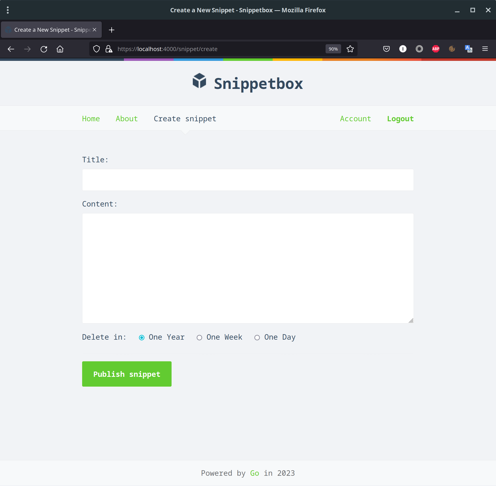

# snippetbox

## Description

This application lets people paste and share snippets of text, a bit like Pastebin or Github's Gists. I have built while reading the [Alex Edwards book "Let's Go"](https://lets-go.alexedwards.net/).



## Prerequisites

* Go (v1.20)
* MySQLDB

## Deployment

### Database

Create a new snippetbox database:

```
-- Create a new UTF-8 `snippetbox` database.
CREATE DATABASE snippetbox CHARACTER SET utf8mb4 COLLATE utf8mb4_unicode_ci;

-- Switch to using the `snippetbox` database.
USE snippetbox;

```

Create a new snippets table to hold the text snippets for our application:

```
-- Create a `snippets` table.
CREATE TABLE snippets (
    id INTEGER NOT NULL PRIMARY KEY AUTO_INCREMENT,
    title VARCHAR(100) NOT NULL,
    content TEXT NOT NULL,
    created DATETIME NOT NULL,
    expires DATETIME NOT NULL
);

-- Add an index on the created column.
CREATE INDEX idx_snippets_created ON snippets(created);
```

Create a new user:

```
CREATE USER 'web'@'localhost';
GRANT SELECT, INSERT, UPDATE, DELETE ON snippetbox.* TO 'web'@'localhost';
-- Important: Make sure to swap 'pass' with a password of your own choosing.
ALTER USER 'web'@'localhost' IDENTIFIED BY 'pass';
```

Create a sessions table in our MySQL database to hold the session data for our users:

```
USE snippetbox;

CREATE TABLE sessions (
    token CHAR(43) PRIMARY KEY,
    data BLOB NOT NULL,
    expiry TIMESTAMP(6) NOT NULL
);

CREATE INDEX sessions_expiry_idx ON sessions (expiry);
```

Create the test version of our MySQL database and test_web user:

```
CREATE DATABASE test_snippetbox CHARACTER SET utf8mb4 COLLATE utf8mb4_unicode_ci;

CREATE USER 'test_web'@'localhost';
GRANT CREATE, DROP, ALTER, INDEX, SELECT, INSERT, UPDATE, DELETE ON test_snippetbox.* TO 'test_web'@'localhost';
ALTER USER 'test_web'@'localhost' IDENTIFIED BY 'pass';
```

### Certificate

For development purposes we can generate a self-signed certificate:

```
$ go run /usr/local/go/src/crypto/tls/generate_cert.go --rsa-bits=2048 --host=localhost
```

## Run

```$ go run cmd/web/!(*_test).go```

## Debug Mode

```$ go run ./cmd/web/ -debug```

## Testing

```$ go test -v ./cmd/web``````

## Features

## API Routes

| Method    | Pattern           | Handler           | Action                            |
| --------- | ----------------- | ----------------- | --------------------------------- |
| ANY       | /                 | home              | Display the home page             |
| GET       | /snippet/view/:id | snippetView       | Display a specific snippet        |
| GET       | /snippet/create   | snippetCreate     | Display the snippet creation form |
| POST      | /snippet/create   | snippetCreatePost | Create a new snippet              |
| GET       | /user/signup      | userSignup        | Display the sign up               |
| POST      | /user/signup      | userSignupPost    | Create a new user                 |
| GET       | /user/login       | userLogin         | Display the login form            |
| POST      | /user/login       | userLoginPost     | User authentication               |
| POST      | /user/logout      | userLogoutPost    | User logout                       |
| GET       | /static/          | http.FileServer   | Serve a specific static file      |

### General

* Command-line flags
* Dependency injection

### Testing

* Unit Testing & sub-tests
* Table-driven tests
* End-to-end testing
* Mocking dependencies
* Testing HTML forms
* Integration testing

### UI

* User interface using HTML template composition
* Dynamic HTML templates
* Caching templates
* Processing forms
* Automatic form parsing
* Contents changes depending on whether a user is authenticated or not

### HTTP

* HTTP status codes
* Serving static files
* Directory listing disabled
* Chaining HTTP handlers
* Stateful HTTP
* Session manager
* HTTPS connection
* HTTP/2 connections

### API

* REST API
* Isolated application routes
* Use of middleware
* Composable middleware chains
* Advanced routing

### Logging & Errors

* Centralized error handling
* Leveled logging
* Request logging
* Panic recovery
* Custom error handlers

### Database

* Database connection with MariaDB
* Use of transactions to execute multiple SQL statements in one atomic action
* Database connection pools
* Use of prepared statements

### Security

* Secure HTTP headers
* Security headers
* Validating form data
* TLS versions restricted
* Cipher suites restricted
* Connection timeouts
* SQL injection prevention
* Sign up
* Authentication
* Authorization
* Logout
* CSRF protection